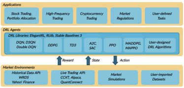

 
# B.Sc. THESIS
**Title**: PORTFOLIO OPTIMIZATION with REINFORCEMENT LEARNING

**Link**: [Research Gate](https://www.researchgate.net/publication/374069161_PORTFOLIO_OPTIMIZATION_with_REINFORCEMENT_LEARNING)

**Aim of the Thesis:**
This graduation thesis aims to create a portfolio management tool for multi-stock trading that utilizes reinforcement learning techniques. The primary aim is to optimize the value of the customer's portfolio by accurately allocating the appropriate amounts to the portfolio assets, including stocks. Additionally, this study aims to provide a comprehensive analysis and evaluation of the decision-making process to facilitate informed decision-making. By conducting a thorough analysis of the outcomes, the study aims to enhance the understanding of the results and their implications for effective decision-making to the user.

-Official Implementation-

**About Source Code**:
Thesis is implemented mainly via [FinRL module](https://github.com/AI4Finance-Foundation/FinRL) which itself includes different modules like StableBaselines3, YahooFinance and etc. which is very useful for the project. Module brings different modular functionalities that allow various preprocessing, feature engineering, and testing methods which constitute the backbone of the project.
Sturcture of FinRL Module:
 

